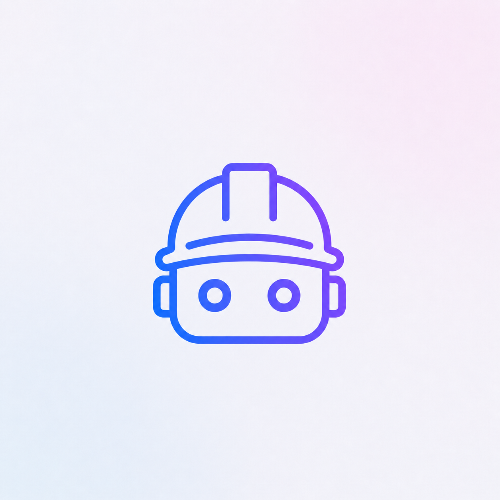
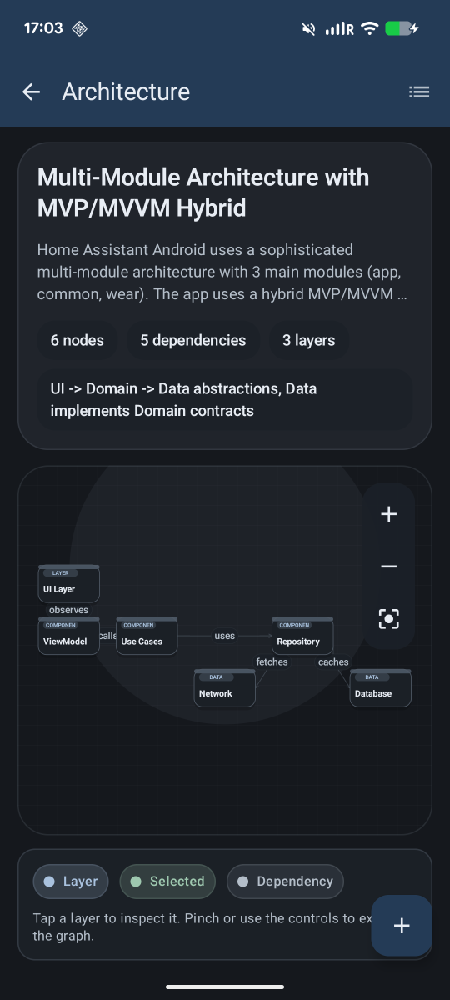
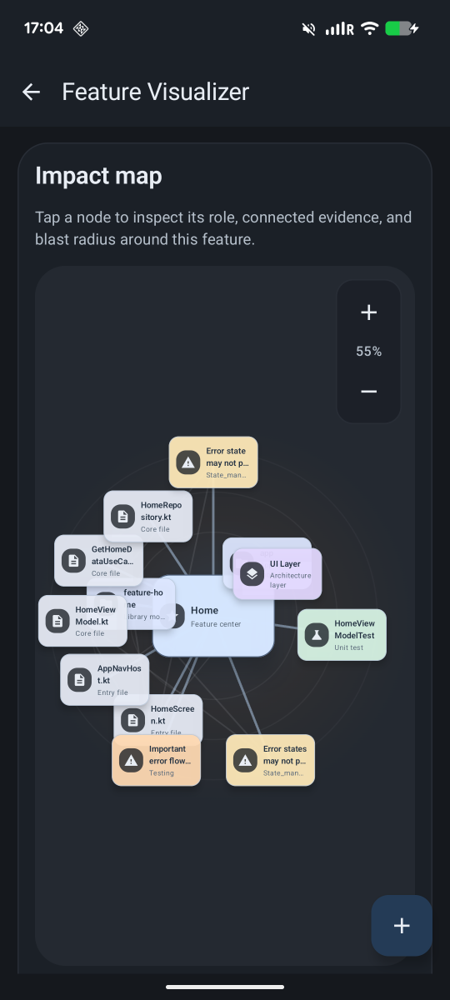
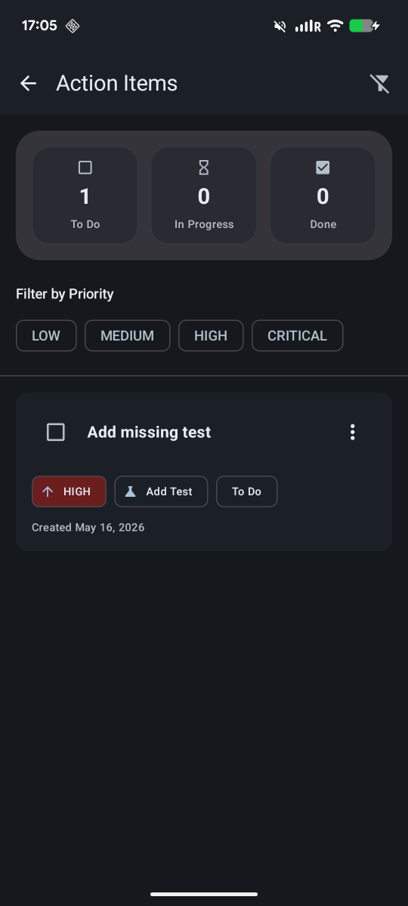
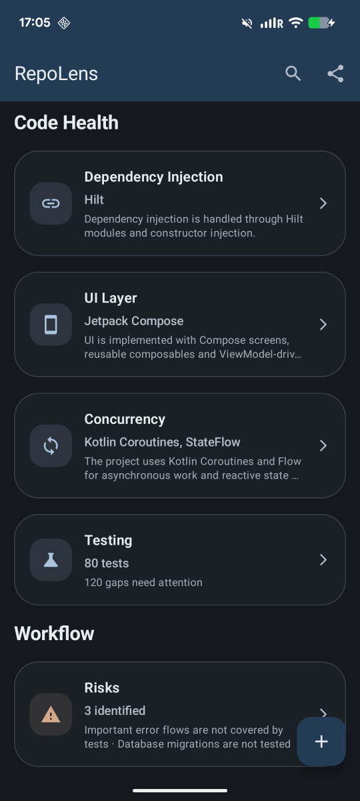
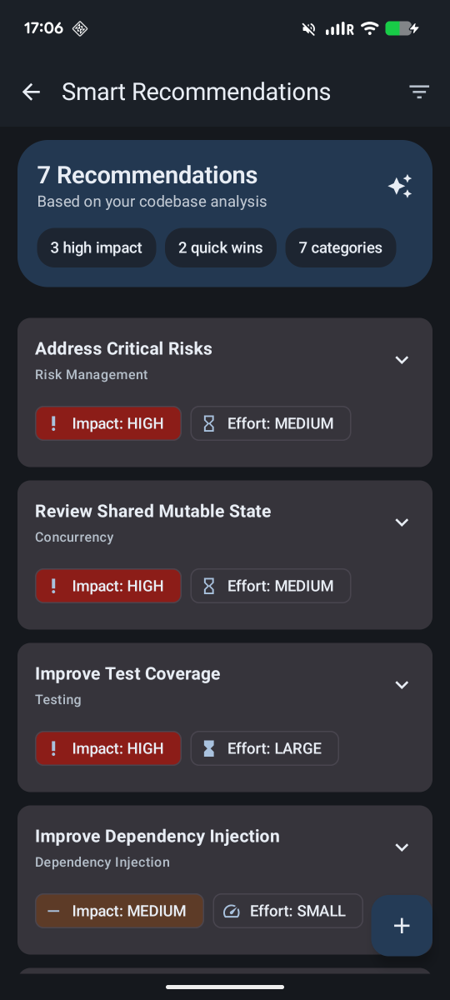

# RepoLens Mobile

<p align="center">
  
</p>

<p align="center">
  <strong>Android-first repository intelligence visualizer powered by IBM Bob</strong>
</p>

<p align="center">
  
  
  
  
  
</p>

<p align="center">
  
  
  
  
  
</p>

---

## Preview

<p align="center">
  
  
  
</p>

<p align="center">
  
  
</p>

---

## Try the App

Download the APK from the latest GitHub Release:

[Download RepoLens Mobile APK](https://github.com/AndreVero/Repolens/releases/latest)

You can install the APK, open RepoLens Mobile, and explore Bob-generated repository analysis reports yourself.

---

## Why a Mobile App?

RepoLens is a mobile app by design.

Since the project focuses specifically on Android repositories, I wanted the solution itself to live inside the Android ecosystem. The goal was to show how IBM Bob can accelerate real mobile development workflows, not only by generating code, but also by helping developers understand architecture, features, risks, tests, recommendations, and PR readiness.

RepoLens is not meant to replace the IDE. Instead, it acts as a lightweight Android-first companion for exploring Bob-generated repository intelligence.

A mobile experience makes the analysis easy to review in a focused, touch-friendly format. This can be useful during onboarding, code review preparation, team discussions, quick project health checks, or when a developer wants to understand a codebase without manually jumping across many files.

The mobile format is part of the product idea: RepoLens is built by an Android developer, for Android projects, using Android-native UI patterns and Material 3.

## Overview

**RepoLens Mobile** is an Android-first repository intelligence visualizer powered by **IBM Bob**.

It helps developers understand complex Android codebases faster by turning Bob-generated repository analysis into an interactive **Material 3** mobile experience.

RepoLens focuses specifically on Android projects because Android codebases have their own complexity: Compose UI, ViewModels, navigation, dependency injection, coroutines, background work, feature modules, repositories, tests, and PR workflows.

Instead of manually exploring dozens or hundreds of files, developers can open RepoLens and quickly understand:

- project architecture
- module structure
- feature boundaries
- UI layer
- dependency injection
- concurrency model
- testing gaps
- risky areas
- smart recommendations
- action items
- PR readiness

RepoLens was built for the **IBM Bob Hackathon** challenge:

> **Turn idea into impact faster**

---

## The Problem

Large Android projects are hard to understand quickly.

Before making even a small change, developers often need to answer questions like:

- Where does this feature start?
- Which screen owns the UI?
- Which ViewModel controls the state?
- Which UseCases and Repositories are involved?
- Where is dependency injection configured?
- Which modules depend on each other?
- What background work or coroutine flows are involved?
- What tests already exist?
- What tests are missing?
- What parts of the codebase are risky?
- Is this change ready for a pull request?

This discovery process is slow, repetitive, and error-prone.

It is especially painful in:

- large Android projects
- legacy mobile apps
- multi-module repositories
- teams with weak documentation
- projects with mixed architecture patterns
- fast-moving product teams
- onboarding flows for new developers

RepoLens reduces this discovery time by turning repository analysis into a structured visual experience.

---

## The Solution

RepoLens uses **IBM Bob** as the repository analysis engine.

Bob analyzes an Android project and generates a structured JSON report. RepoLens Mobile parses that JSON and turns it into clickable dashboards and detail screens.

```text
Android Repository
        ↓
IBM Bob analyzes codebase
        ↓
Bob generates structured JSON report
        ↓
RepoLens Mobile parses report
        ↓
Developer explores architecture, features, risks, and action items
```

The app does not call AI APIs directly.

Instead, RepoLens demonstrates a practical workflow:

1. Use IBM Bob to understand the repository.
2. Ask Bob to generate a structured report.
3. Visualize that report inside an Android app.
4. Help developers act on the insights faster.

---

## Why Android-first?

RepoLens is intentionally focused on Android repositories.

A generic code summary tool can tell you what files exist, but Android developers need more specific insights:

- Which screen belongs to which feature?
- Which ViewModel owns the state?
- Where is the navigation route?
- Is this logic in UI, domain, or data layer?
- Is dependency injection scoped correctly?
- Are coroutine flows safe?
- Are background workers tested?
- Are error states handled?
- What should be tested before opening a PR?

RepoLens is designed around these Android-specific questions.

As an Android developer, I built RepoLens to solve a problem I personally understand: in mobile development, the hardest part is often not writing code, but understanding the existing codebase safely and quickly.

---

## Killer Features

### Architecture Visualizer

RepoLens turns Bob’s architecture analysis into an interactive architecture map.

It helps developers understand:

- architecture style
- architecture layers
- data flow
- dependency direction
- UI/domain/data separation
- important files and classes
- architecture strengths
- architecture concerns
- improvement recommendations

<p align="center">
  
</p>

This is useful when joining a new Android project or trying to understand how a large app is structured before making changes.

---

### Feature Visualizer

RepoLens visualizes detected features and their surrounding code impact.

For each feature, it can show:

- feature purpose
- entry points
- screens
- ViewModels
- UseCases
- repositories
- UI components
- navigation routes
- dependencies
- existing tests
- missing tests
- risks
- related architecture layers

<p align="center">
  
</p>

This helps developers understand feature boundaries faster instead of manually jumping between many files.

---

### Risk Management

RepoLens groups Bob-detected risks by severity and makes them actionable.

Each risk can include:

- severity
- category
- affected files
- affected modules
- why it matters
- recommendation
- suggested test
- confidence score

This helps developers focus on the highest-impact problems first.

Examples of risks RepoLens can surface:

- missing error-state tests
- unclear dependency direction
- unsafe coroutine handling
- untested background work
- broad dependency injection scopes
- fragile navigation routes
- missing persistence migration tests

---

### Smart Recommendations

RepoLens does not only describe the project. It helps developers decide what to improve next.

Smart recommendations can include:

- add missing ViewModel tests
- review dependency injection scopes
- inject dispatchers for coroutine testability
- move business logic out of UI
- improve navigation safety
- document unclear module responsibilities
- add tests for background sync
- validate error handling paths

<p align="center">
  
</p>

The goal is to turn repository understanding into practical engineering decisions.

---

### Action Items

RepoLens converts analysis into concrete tasks.

Action items help with:

- onboarding
- refactoring
- test planning
- QA preparation
- PR preparation
- risk reduction
- architecture cleanup

<p align="center">
  
</p>

This makes the Bob-generated analysis actionable instead of being just a static report.

---

### Code Health Overview

RepoLens provides a high-level project health dashboard.

It can summarize:

- dependency injection
- UI layer
- concurrency
- testing gaps
- risks
- workflow readiness
- missing coverage
- project quality signals

<p align="center">
  
</p>

This gives developers and reviewers a quick understanding of what needs attention.

---

## IBM Bob Usage

IBM Bob is a core part of this project.

Bob was used for:

### 1. Project Generation

Bob helped generate and shape the initial Android app structure:

- Compose screens
- app architecture
- data models
- repository loading logic
- UI organization

### 2. Architecture Design

Bob helped design the RepoLens architecture:

- JSON-driven visualization flow
- screen structure
- data model structure
- reusable UI components
- app navigation

### 3. JSON Schema Design

Bob helped design the structured repository report schema, including:

- metadata
- repository overview
- metrics
- architecture
- modules
- features
- dependency injection
- concurrency
- UI layer
- networking
- persistence
- testing
- risks
- recommendations
- action items
- PR readiness

### 4. Repository Analysis

Bob analyzed real Android repositories and generated structured reports that RepoLens can visualize.

The app includes Bob-generated reports for real Android projects such as:

- Home Assistant Android
- Ivy Wallet
- Now in Android

### 5. Final Review

Bob was also used to review the project, improve the submission, and validate the hackathon workflow.

All relevant Bob task/session exports are included in the `bob_sessions/` folder.

---

## How It Works

```text
1. Open an Android repository in IBM Bob
2. Ask Bob to analyze the repository using the RepoLens schema
3. Bob generates a structured JSON report
4. Add the report to RepoLens Mobile
5. RepoLens parses the JSON
6. Developers explore the repository intelligence in a Material 3 Android app
```

RepoLens acts as a mobile-first renderer for Bob-generated development intelligence.

---

## Expected JSON Report

RepoLens expects structured JSON with sections like:

```json
{
  "metadata": {},
  "repository": {},
  "metrics": {},
  "architecture": {},
  "modules": [],
  "features": [],
  "dependencyInjection": {},
  "concurrency": {},
  "uiLayer": {},
  "networking": {},
  "persistence": {},
  "testing": {},
  "risks": [],
  "prReadiness": {},
  "documentation": {},
  "bobUsage": {}
}
```

This schema was designed with IBM Bob to represent Android repository structure in a way that can be rendered as an interactive mobile UI.

---

## App Experience

RepoLens Mobile includes several focused screens.

### Repository Overview

A high-level dashboard with:

- repository summary
- architecture style
- main language
- frameworks
- module count
- feature count
- risk count
- missing test count
- PR readiness score

### Architecture

A visual breakdown of:

- UI layer
- domain layer
- data layer
- data flow
- dependency direction
- strengths
- concerns
- recommendations

### Feature Visualizer

A feature-level impact map showing:

- entry files
- core files
- feature center
- tests
- risks
- related architecture layers
- connected evidence

### Risk Management

A risk dashboard grouped by severity, showing:

- affected files
- why the risk matters
- recommendations
- suggested tests

### Smart Recommendations

A prioritized list of improvements generated from Bob’s analysis.

### Action Items

A task-oriented view that turns repository insights into practical next steps.

### PR Readiness

A delivery-focused view that helps developers prepare better pull requests with:

- ready items
- attention items
- QA checklist
- reviewer notes
- rollback plan

---

## Tech Stack

| Area | Technology |
|---|---|
| Language | Kotlin |
| UI | Jetpack Compose |
| Design System | Material 3 |
| Navigation | Navigation Compose |
| Serialization | Kotlinx Serialization |
| Dependency Injection | Hilt |
| Local Persistence | Room |
| State Management | StateFlow |
| Architecture | MVVM |
| Build System | Gradle Kotlin DSL |
| AI Development Partner | IBM Bob |

---

## Project Structure

```text
app/
├── src/main/
│   ├── assets/
│   │   ├── home_assistant_android_analysis_report.json
│   │   ├── ivy_wallet_analysis_report.json
│   │   ├── nowinandroid_analysis_report.json
│   │   └── repolens_sample_report.json
│   │
│   └── java/com/vero/repolens/
│       ├── data/
│       ├── ui/
│       │   ├── components/
│       │   ├── navigation/
│       │   ├── screens/
│       │   └── theme/
│       └── viewmodel/
│
bob_sessions/
├── exported Bob task history files
└── Bob task consumption screenshots
│
docs/
├── screenshots
└── app icon
```

---

## Hackathon Impact

RepoLens helps developers move faster by reducing the time needed to understand an existing Android project.

### Before RepoLens

Developers manually inspect:

- modules
- navigation
- ViewModels
- repositories
- tests
- dependency injection setup
- background work
- risky areas

This can take hours or days in a large project.

### After RepoLens

IBM Bob analyzes the repository and RepoLens visualizes the result.

Developers get:

- faster onboarding
- clearer architecture understanding
- feature-level maps
- risk visibility
- missing test suggestions
- smarter recommendations
- concrete action items
- better PR preparation

RepoLens turns repository complexity into structured, actionable insight.

---

## Bob Sessions

For hackathon transparency, exported IBM Bob task/session reports are included in:

```text
bob_sessions/
```

These sessions demonstrate how IBM Bob was used for:

- project generation
- architecture design
- schema creation
- repository analysis
- final project review

This is an important part of the project because RepoLens is not just an Android app. It is a workflow showing how Bob can transform repository context into structured development intelligence.

---

## Demo Flow

A typical demo looks like this:

1. Open a real Android project in IBM Bob.
2. Ask Bob to analyze the project.
3. Bob generates a structured RepoLens JSON report.
4. Open RepoLens Mobile.
5. Select a generated report.
6. Explore architecture.
7. Open feature visualization.
8. Review risks.
9. Check smart recommendations.
10. Convert insights into action items.
11. Review PR readiness.

---

## Limitations

This is a hackathon proof of concept.

Current limitations:

- RepoLens does not perform live repository analysis inside the app.
- Reports must be generated by IBM Bob first.
- AI-generated insights should be reviewed by a human developer.
- The report represents a snapshot of the repository at the time of analysis.
- The current version focuses on Android repositories.

---

## Future Improvements

Possible next steps:

- import JSON reports from device storage
- support multiple saved reports
- compare two repository reports
- search across modules, files, risks, and recommendations
- export insights as Markdown or PDF
- add tablet and foldable layouts
- improve dark theme polish
- filter by severity, module, feature, or file
- integrate with CI-generated Bob reports
- support Kotlin Multiplatform and Compose Multiplatform repositories
- generate PR checklists directly from repository diffs

---

## Why This Matters

AI coding tools often focus on generating code.

RepoLens focuses on something equally important in real engineering teams:

> understanding the existing codebase before changing it.

For Android developers, this means understanding not only classes and files, but also UI state, navigation, dependency injection, coroutines, tests, background work, and feature ownership.

RepoLens shows how IBM Bob can turn complex Android repository context into structured development intelligence, and how a mobile app can make that intelligence easy to explore and act on.

---

## Author

Built by **Andrii Veremiienko**  
Android Developer

---

## License

MIT License

---

## Note

RepoLens is a visualization tool for IBM Bob-generated repository intelligence.

It does not replace code review, testing, or human engineering judgment.  
It helps Android developers understand projects faster and act with more confidence.
